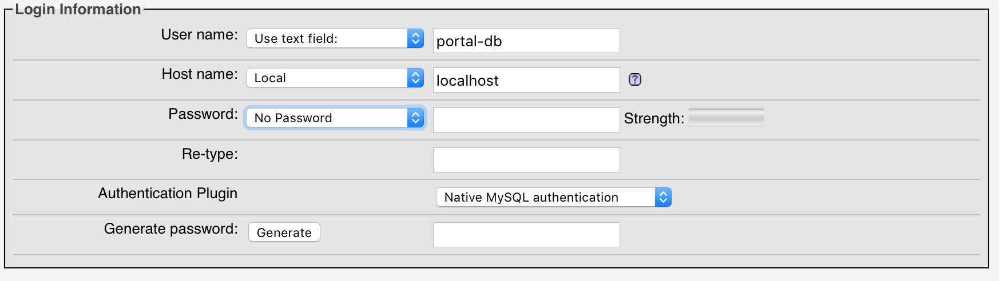
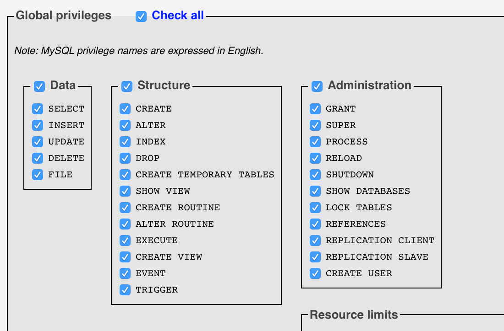

# Running the application locally

An Apache server and MySQL server are required to run our application. We recommend MAMP. You can download it [here](https://www.mamp.info/en/downloads/)

## To configure MAMP
- Go to Preferences
    1) Change the MySQL port to `3316`
    2) Change the PHP version to `7.0.x`
    3) In the Web Server tab, change the document root to the `app` folder of this repository
- Hit OK
- Click Start Servers to run the server.

## Configuring the MySQL database
- From MAMP, open the Webstart Page and access phpMyAdmin
- Create a database named **portal-db**
- Click on the newly created database
- Import the portal-db.sql file (leave the default settings)

Now, you need to create a **database user** within phpMyAdmin. This **database user** will be our PHP app.

- Click the **privileges** tab
- Click **add user account**
- Make the user name "portal" and with host = **local** and no password

- Scroll down and grant all privileges

- Add the database user

- Go to the 'user' table of **portal-db** to get a username and password to log in
- A username might be **pe21356n** with password **pass2**
- Go to `localhost` from a browser and log in!

# Contributing to the application
1. Fork this repository
2. In your fork, create a feature branch off of the `develop` branch
3. **Write some code!** Each team has a "tab" on the portal
4. Rebase your feature branch off of the current `develop` branch. (Other PRs might have been merged while you were **writing some code**)
5. Open a pull request from your feature branch to the `develop` branch of this repository

# Where to Contribute
- Navigate to the **infrastructure -> app -> Student** or **infrastructure -> app -> Instructor** and the folder with your group name.
- You should see an "index.php" file and a file with your group name. You should add content with your group name. You can add other files and folders to this folder.
- **Please do not modify index.php**
- You do not need to add any headers or footers, as those are handled at the app level.

For example, the html grading group should modify:
`app/Student/html/html_grading.php`
and
`app/Instructor/html/html_grading.php`

**Adding Styles**
- If you are using SCSS, please create a new scss file (try to keep it to one file per group) in the "infrastructure -> app -> sass" directory
- If you are using plain CSS, please create a new css file (try to keep it to one file per group) in the "infrastructure -> app -> stylesheets"
- Please do not alter any of the existing SCSS/CSS files
